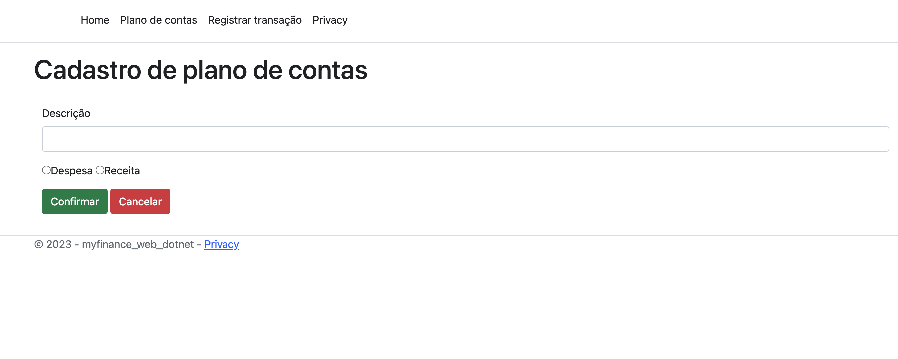
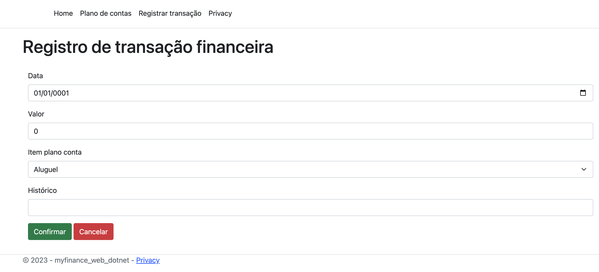
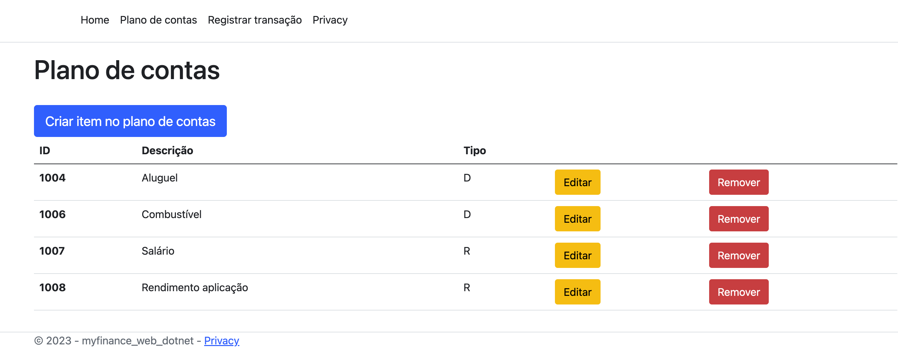
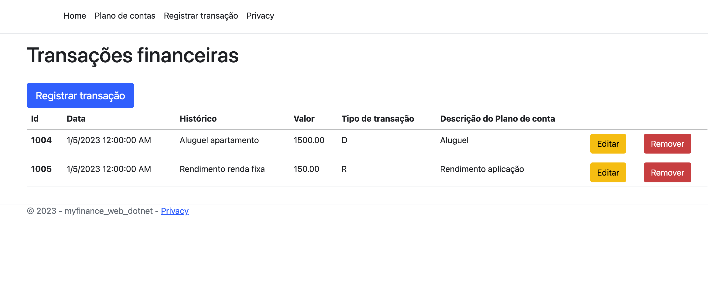

## My Finance Web - Controle de finanças pessoais
---

Projeto desenvolvido na disciplina "Práticas de implementação de evolução de software", parte do curso de Pós-graduação em Engenharia de software na Pontifícia Universidade Católica de Minas Gerais.

## Sumário
---

<!--ts-->
   * [Sobre](##Sobre)
   * [Features](##Features)
   * [Tecnologias utilizadas](##instalacao)
   * [Como usar](##como-usar)
      * [Pre Requisitos](##pre-requisitos)
      * [Local files](##local-files)
      * [Remote files](##remote-files)
      * [Multiple files](##multiple-files)
      * [Combo](##combo)
   * [Tests](##testes)
   * [Tecnologias](##tecnologias)
   * [Autor](##autor)
<!--te-->

## :information_source: Sobre
---

A aplicação tem como objetivo permitir o controle de finanças pessoais por meio da criação de categorias de fluxo (plano de contas) e registro de transações.

## :gear: Features
---

- [x] Cadastro de categorias no plano de contas
- [x] Edição de categorias no plano de contas
- [x] Cadastro de transações vinculadas a uma categoria
- [x] Edição de transações vinculadas a uma categoria

## :computer: Demonstração da aplicação
---

- ### Cadastro de plano de contas
    ---

    

    
    

    
- ### Cadastro de transações
    ---

    

    
    

- ### Lista de plano de contas
    ---

    

    
    

- ### Lista de transações
    ---

    

    
    

## :hammer_and_wrench: Tecnologias utilizadas
---

- [ASP.NET Core MVC](https://learn.microsoft.com/pt-br/aspnet/core/tutorials/first-mvc-app/start-mvc?view=aspnetcore-7.0&tabs=visual-studio);
- [Entity Framework](https://learn.microsoft.com/pt-br/ef/)
- [Microsoft SQL Server](https://pt.wikipedia.org/wiki/Microsoft_SQL_Server);

## Autor
---

<a href="https://blog.rocketseat.com.br/author/thiago/">
 
  
<b>Nilton Fernandes</b>